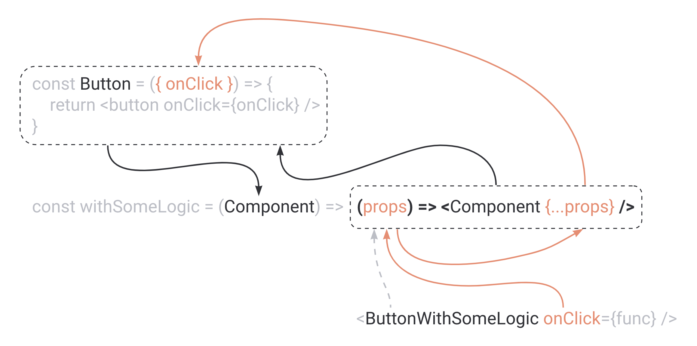

# React higher-order component

## 前言

我们希望解答三个问题，什么是 React 高阶组件？如何使用 React 高阶组件？以及在 React hooks 时代中，我们还需要高阶组件吗？

## 什么是 higher-order component？

根据 [React docs](https://legacy.reactjs.org/docs/higher-order-components.html) 描述

> A higher-order component (HOC) is an advanced technique in React for reusing component logic. HOCs are not part of the React API, per se. They are a pattern that emerges from React’s compositional nature.
> 
> Concretely, **a higher-order component is a function that takes a component and returns a new component.**

也就是说， 它只是一个函数，接受一个组件作为参数之一，然后对其进行处理，返回修改后的版本。（和 wrapper function 概念几乎一样，类似于 debounce, throttle 这样的 wrapper utility）

```jsx
// accept a Component as an argument
const withSomeLogic = Component => {
  // do something

  // return a component that renders the component from the argument
  return props => <Component {...props} />;
};
```

在 `withSomeLogin` 中，我们返回了一个新的函数组件（这很关键）

然后，我们就可以像这样使用它

```jsx
const Button = ({onClick}) = <button onClick={onClick}>Button</button>
const ButtonWithSomeLogic = withSomeLogic(Button)
```

我们将 `Button` 组件传递给该函数，它将返回一个新的函数组件，其中包括高阶组件中定义的任何逻辑

我们可以在脑海中绘制出一幅图



